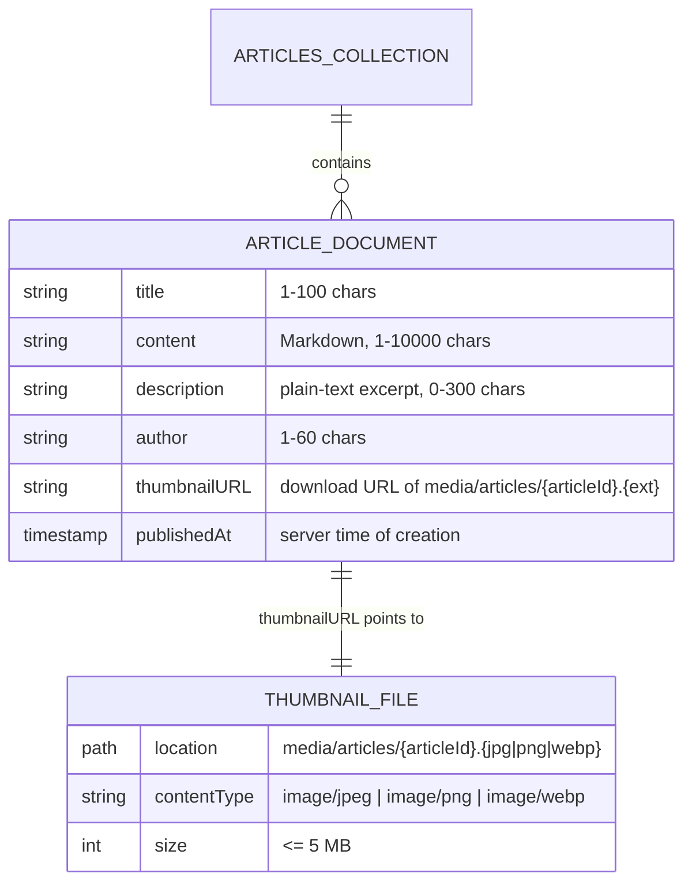
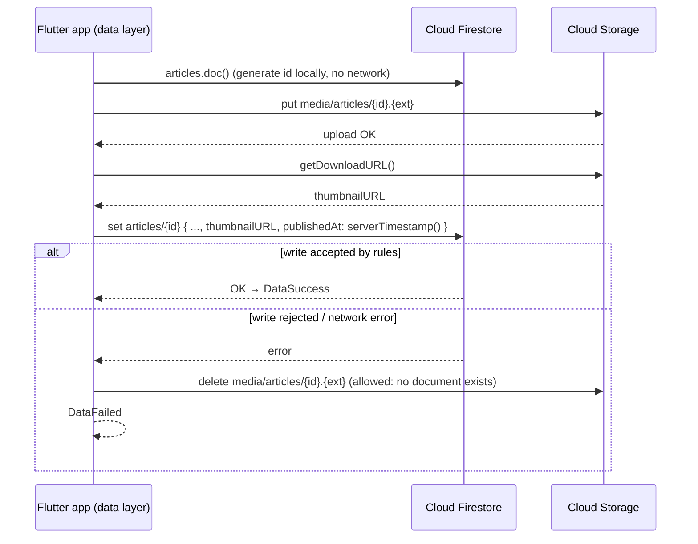

# Database Schema

This document describes how journalist-published articles are stored in
**Firebase Cloud Firestore** (metadata and content) and **Firebase Cloud Storage**
(thumbnails). It is the single source of truth for:

- the Firestore/Storage security rules (`backend/firestore.rules`, `backend/storage.rules`),
- the domain entity and validations in the Flutter app (`publish_article` feature),
- the data model that parses Firestore documents (`fromRawData` / `toEntity`).

Any change here must be reflected in those three places.

## Overview



| Resource | Path |
|---|---|
| Firestore collection | `articles` |
| Firestore document | `articles/{articleId}` |
| Storage folder | `media/articles/` |
| Storage object | `media/articles/{articleId}.{extension}` |

`{articleId}` is the Firestore auto-generated document id (20 alphanumeric characters).
The **same id** names the thumbnail file, which gives a 1:1 link between a document and its
image that the security rules can verify.

## Collection `articles`

### Document `articles/{articleId}`

| Field | Type | Required | Constraints | Set by | Purpose |
|---|---|---|---|---|---|
| `title` | `string` | yes | 1–100 characters after trimming | Journalist | Headline shown in the list and detail screens. |
| `content` | `string` | yes | 1–10 000 characters after trimming. **Markdown** (bold, italics, headings, lists). | Journalist | Full body of the article, rendered as Markdown in the detail screen. |
| `description` | `string` | yes | 0–300 characters | App (derived) | Plain-text excerpt of `content` (Markdown syntax stripped) for the list tile. Stored so the list never has to download or parse the full body. |
| `author` | `string` | yes | 1–60 characters after trimming | Journalist | Byline. Free text while the app has no authentication (see [Future evolution](#future-evolution)). |
| `thumbnailURL` | `string` | yes | Firebase Storage download URL of `media/articles/{articleId}.{jpg\|png\|webp}`, where `{articleId}` is **this** document's id | App | Reference to the thumbnail in Cloud Storage, loadable directly by `CachedNetworkImage`. |
| `publishedAt` | `timestamp` | yes | Must equal the server time of the write (`request.time`) | Server (`FieldValue.serverTimestamp()`) | Publication date. It cannot be forged or backdated by the client. |

Rules that apply to the whole document:

- **Closed shape**: a document must contain exactly the six fields above, no more and no fewer.
- **Immutable**: documents can be created and read, but not updated or deleted, while the app has
  no authentication. Otherwise any client could edit or delete any journalist's work.
- The document id is not stored as a field. The model reads it from `DocumentSnapshot.id`.
  It must have the shape of a Firestore auto-generated id (20 alphanumeric characters).
- **Lengths are measured in UTF-16 code units**, which is what the security rules' `size()`
  counts. It is identical to Dart's `String.length`, so an emoji counts as 2 (a title fits
  50 emoji, not 100). The UI counter and the entity must use `String.length`. Flutter's
  `TextField.maxLength` counts grapheme clusters instead, so it cannot be used as-is.

#### Example document

`articles/Xk3P9aQzT1mB7cL2vR8w`

```json
{
  "title": "Breaking News!",
  "content": "## Arnold spotted in the park\n\nThis is **breaking news**! Arnold Schwarzenegger has been seen ...",
  "description": "Arnold spotted in the park This is breaking news! Arnold Schwarzenegger has been seen ...",
  "author": "Daily News Staff",
  "thumbnailURL": "https://firebasestorage.googleapis.com/v0/b/backend-news-symmetry.firebasestorage.app/o/media%2Farticles%2FXk3P9aQzT1mB7cL2vR8w.jpg?alt=media&token=5b0c7c1e-...",
  "publishedAt": "2026-09-28T10:52:31.412Z"
}
```

### Queries and indexes

| Screen | Query | Index |
|---|---|---|
| Home, community tab | `articles` ordered by `publishedAt` desc, paginated with `limit(20)` + `startAfterDocument` | Automatic single-field index (no composite index required) |

List queries **must** set a `limit` of at most 50. Otherwise the rules reject them, so no client
can download the whole collection in one request.
| Article detail | Read from the list (the whole document is already loaded) | none |

## Cloud Storage `media/articles/`

| Property | Constraint |
|---|---|
| Path | `media/articles/{articleId}.{extension}` |
| Allowed extensions → content type | `jpg` → `image/jpeg`, `png` → `image/png`, `webp` → `image/webp` |
| Maximum size | 5 MB |
| Create | Only if the object does not exist yet **and** no article with that id exists yet. Re-uploading to an existing path counts as a `create` in Storage rules, so the rule checks `resource == null` explicitly |
| Update | Denied |
| Delete | Only while **no** Firestore document `articles/{articleId}` exists. This allows cleanup of orphaned uploads but never deletion of a published article's image |
| Read | Public |

The extension is kept from the picked image instead of forcing `.jpg`, so the app does not have
to re-encode images. The rules make sure the extension and the declared `contentType` match.

## Publishing flow

The thumbnail is uploaded **before** the document is written, so a published article never points
to a missing image. If the document write fails, the app deletes the uploaded image so no orphaned
files are left behind.



## Where each constraint is enforced

Every constraint is validated at three levels. The UI gives immediate feedback, the domain entity
is the business rule, and the security rules are the final authority that no client can bypass.

| Constraint | UI (form) | Domain (entity) | Security rules |
|---|---|---|---|
| Title 1–100 chars | Live character counter + field error | ✔ | `firestore.rules` |
| Content 1–10 000 chars | Field error | ✔ | `firestore.rules` |
| Description ≤ 300 chars, derived | n/a | ✔ (derivation logic lives in the entity) | `firestore.rules` |
| Author 1–60 chars | Field error | ✔ | `firestore.rules` |
| Thumbnail required | Field error on the *Attach Image* control | ✔ | `firestore.rules` (URL shape and id) |
| Image type and ≤ 5 MB | Gallery-only picker, size error | ✔ | `storage.rules` |
| `publishedAt` = server time | n/a | n/a | `firestore.rules` |
| Closed shape and immutability | n/a | n/a | `firestore.rules` |

## Relation to the NewsAPI article

The existing `daily_news` feature consumes [NewsAPI](https://newsapi.org/docs/endpoints/top-headlines).
This schema was designed by studying that payload and keeping what makes sense for articles
written inside the app:

| NewsAPI field | This schema | Reason |
|---|---|---|
| `source` | dropped | Every article comes from this app |
| `author` | `author` | Kept |
| `title` | `title` | Kept, with a length limit |
| `description` | `description` | Kept, but **derived** from `content` instead of typed separately |
| `url` | dropped | The full article lives in `content`, not on an external site |
| `urlToImage` | `thumbnailURL` | Renamed as required by the assignment, and must point to Cloud Storage |
| `publishedAt` (ISO string) | `publishedAt` (timestamp) | Native timestamp: sortable, timezone-safe, server-assigned |
| `content` (truncated to 200 chars) | `content` (full Markdown) | Journalists write the complete article with formatting |

## Future evolution

These changes are out of the current scope but the schema is ready for them:

- **Authentication**: add `authorId: string` (the Firebase Auth uid) and restrict `create` to
  `request.auth.uid == request.resource.data.authorId`. That in turn allows `update`/`delete` by
  the owner, which is needed to edit or delete articles.
- **`authors/{uid}` collection**: public profile (display name, avatar). `author` would become a
  denormalized copy of the display name so the list still needs a single query.
- **Categories and tags**: `category: string` plus a composite index `(category, publishedAt desc)`.
- **App Check**: attest that writes come from the genuine app, which reduces spam while the
  collection accepts writes from unauthenticated clients.
