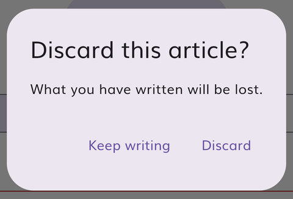
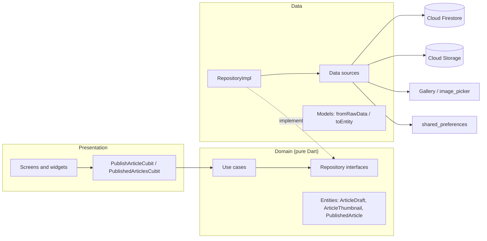

# Reporte: publicar artículos desde la app

Funcionalidad entregada: **un periodista puede escribir un artículo en Markdown, adjuntar una
miniatura desde la galería y publicarlo**. El artículo queda guardado en Firebase (Firestore y
Cloud Storage) y aparece para todos en la pestaña *Community* de la app.

| | |
|---|---|
| Rama | `feature/publish-article` (32 commits, uno por paso) |
| Backend | [`backend/docs/DB_SCHEMA.md`](../backend/docs/DB_SCHEMA.md), [`firestore.rules`](../backend/firestore.rules), [`storage.rules`](../backend/storage.rules) |
| Frontend | [`frontend/lib/features/journalist_articles/`](../frontend/lib/features/journalist_articles) |
| Tests | 143 unitarios y de widgets, 66 de reglas de seguridad y 1 de integración de extremo a extremo |
| CI | [GitHub Actions](../.github/workflows/ci.yml), los tres jobs en verde |
| Vídeo | [`docs/media/publish-journey.mp4`](./media/publish-journey.mp4) (40 s) |

---

## 1. Introducción

Tengo **2 años de experiencia con Flutter**. **BLoC y Cubit** los uso a diario, así que la capa
de presentación y la gestión de estado eran terreno conocido. **Firebase** lo había usado poco,
sobre todo para notificaciones push. Por eso la parte nueva de verdad era el backend:
modelar datos en Firestore, guardar archivos en Cloud Storage y, sobre todo, **hacer cumplir un
esquema con reglas de seguridad** y probarlas.

Me propuse seguir el README al pie de la letra y en su orden: primero el esquema, después el
backend y sus reglas, luego el dominio con datos simulados (*mock*), la UI y, por último, la capa
de datos real. Trabajé en una rama propia y avancé por fases, revisando y aprobando cada una
antes de pasar a la siguiente.

## 2. Proceso de aprendizaje

Mi base viene del **tecnólogo en Análisis y Desarrollo de Software**. Allí se explicó a fondo el
lenguaje que después elegí; me gustó y seguí por ese camino, perfeccionando la lógica y el uso
de librerías.

En este proyecto aprendí y apliqué sobre la marcha:

| Tecnología | Cómo la apliqué |
|---|---|
| **Modelado en Firestore** | Un esquema documentado antes de programar, con restricciones por campo y un flujo de publicación con limpieza de imágenes huérfanas ([DB_SCHEMA.md](../backend/docs/DB_SCHEMA.md)). |
| **Reglas de seguridad** | Forma cerrada del documento, longitudes, `publishedAt == request.time`, listados limitados a 50, solo creación. En Storage: tipo de archivo según la extensión, 5 MB, sin sobrescribir y consulta a Firestore desde las reglas. |
| **Tests de reglas** | `@firebase/rules-unit-testing` con el runner nativo de Node (`node:test`): 66 tests, incluidos los casos límite. |
| **Firebase Emulator Suite** | Desarrollo y tests sin tocar producción. La app tiene un modo emulador (`--dart-define=USE_FIREBASE_EMULATORS=true`). |
| **FlutterFire** | Configuración solo para Android, reutilizando la app ya registrada en Firebase. |
| **`integration_test`** | Un test del recorrido completo en el dispositivo, contra el emulador de Firebase. |
| **GitHub Actions** | CI con análisis, tests, reglas y el test de integración en un emulador Android. |

Me apoyé en la documentación oficial de Firebase y Flutter y en un asistente de IA (ver la
[sección 7.1](#71-uso-de-inteligencia-artificial)), comprobando cada decisión antes de darla por
buena.

## 3. Retos encontrados

Estos son los problemas reales que aparecieron, cómo se resolvieron y qué aprendí de cada uno.

| Reto | Solución | Aprendizaje |
|---|---|---|
| **El proyecto no compilaba**: Kotlin 1.6.10 está por debajo del mínimo de Flutter 3.27, y una dependencia transitiva (`win32` 5.3.0) no compila con Dart ≥ 3.5. | Kotlin 1.9.24, Gradle 8.7, `win32` 5.5.4, versión fijada con FVM (`.fvmrc`) y `dio`/`sqflite` declaradas como dependencias directas. | Diagnosticar primero el entorno y dejarlo reproducible. |
| **Storage devolvía `storage/unauthorized`** con reglas correctas. | Había **dos causas con el mismo error**: el proyecto estaba en el plan Spark, que bloquea el bucket, y a Storage le faltaba el permiso IAM para consultar Firestore desde las reglas. Pasé a Blaze (con alerta de presupuesto) y concedí el rol. | Un mismo mensaje de error puede ocultar causas distintas: hay que aislarlas con pruebas pequeñas. |
| **Las reglas cuentan las longitudes en unidades UTF-16**: un emoji cuenta 2. | Lo descubrí con un test que falló. La entidad usa `String.length`, que mide igual, y el contador de la UI también. El `maxLength` de Flutter cuenta un emoji como 1 y habría aceptado títulos que el backend rechaza. | Validar en UI, entidad y reglas solo sirve si las tres miden igual. |
| **En Storage, volver a subir un archivo con el mismo nombre cuenta como `create`, no como `update`.** | Lo encontró un test: `allow create: if resource == null && …`. | Los tests de reglas encuentran huecos reales. |
| **Sin conexión, una escritura de Firestore no falla: se queda en cola.** Llegaría tarde, cuando la imagen ya se habría borrado. | El artículo se escribe dentro de una **transacción**, que necesita el servidor, con un límite de 20 s. La subida a Storage abandona a los 30 s en lugar de reintentar hasta 10 minutos. | Diseñar el camino de error igual de bien que el de éxito. |
| **URLs del emulador**: `127.0.0.1` dentro del emulador Android es el propio teléfono. | El seed guarda las URLs con `10.0.2.2` en modo emulador, y las reglas aceptan ese host. | Probar en el dispositivo destapa lo que los tests unitarios no ven. |
| **`bloc_test` no se puede instalar**: choca con el `analyzer` de `retrofit_generator` 3.0.1+1. | Un pequeño helper (`statesEmittedBy`) que registra los estados que emite el cubit, con `flutter_test` y `mocktail`. | Adaptarse a las restricciones de un código heredado sin reescribirlo entero. |
| **`flutterfire_cli` global no arrancaba con Dart 3.6** y se ofrecía a actualizarse solo, con "sí" por defecto. | Lo ejecuté con otro Dart sin tocar la instalación global, y contestando "no" explícitamente. | No modificar herramientas globales que usan otros proyectos. |
| **Detalles visuales solo visibles en el dispositivo**: la barra de Markdown se salía 26 px, y el aviso de error duraba demasiado poco para leerlo. | Barra en dos filas y aviso de 10 s. | Ver la app funcionando, no solo los tests en verde. |
| **GitHub marcó las claves de Firebase como secretos.** | Son identificadores públicos que van dentro de cada APK. Comprobé que están restringidas a las APIs de Firebase y lo documenté en [Security](../backend/README.md#security). | Entender una alerta antes de "arreglarla": aquí la defensa real son las reglas y las restricciones de la clave, no esconder la clave. |

## 4. Reflexión y próximos pasos

**Técnicamente**, lo más valioso fue tratar el backend como parte del producto: un esquema
escrito primero y aplicado **en tres niveles** (UI, entidad de dominio y reglas de seguridad),
con tests en cada nivel. También aplicar la arquitectura limpia del proyecto sin excepciones: el
dominio es Dart puro, Firebase solo aparece en los `data_sources`, los modelos tienen
`fromRawData`/`toEntity`, los repositorios `…Impl` devuelven `DataState` y solo los cubits usan
los use cases. Hasta la galería del móvil pasa por esas capas.

**Profesionalmente**, trabajar por fases pequeñas con commits atómicos, revisar cada fase antes
de avanzar y verificarlo todo en el dispositivo y en el CI me dio confianza en lo entregado.

**Mejoras propuestas para el proyecto:**
1. **Autenticación** (anónima o con email) con `authorId` en el esquema y reglas por propietario,
   lo que permitiría **editar y borrar** los artículos propios. El esquema ya está preparado
   ([Future evolution](../backend/docs/DB_SCHEMA.md#future-evolution)).
2. **App Check** (Play Integrity) obligatorio en Firestore y Storage, para rechazar clientes que no
   sean la app auténtica.
3. **Cloud Function programada** que borre imágenes huérfanas, ahora que el proyecto está en Blaze.
4. **Actualizar las dependencias heredadas** (retrofit 4, dio 5, floor, build_runner). Hoy
   bloquean herramientas modernas como `bloc_test`.
5. **Community en tiempo real**, **autoguardado del borrador**, **modo oscuro** e **i18n**
   (español e inglés).
6. **iOS**: el repositorio solo tiene Android.

## 5. Pruebas del proyecto

### Vídeo
[`docs/media/publish-journey.mp4`](./media/publish-journey.mp4): el test de integración
ejecutándose a cámara lenta en un emulador Android, contra el emulador de Firebase. Recorre la
validación, la escritura, la imagen, la publicación, el artículo en *Community* y el detalle con
Markdown.

### Capturas

| Home: Top news | Community (producción) | Errores por campo | Solo galería |
|---|---|---|---|
|  |  |  |  |

| Formulario completo | Publicando | Detalle en Markdown | Sin conexión: reintentar |
|---|---|---|---|
|  |  |  |  |

| Firma recordada | Confirmación al descartar |
|---|---|
|  |  |

### Verificación en producción
Publiqué un artículo real desde la app. El documento `articles/VjV1yr3rUSC8zMzMouvG` tiene
exactamente los 6 campos del esquema y `publishedAt` asignado por el servidor. Su miniatura
`media/articles/VjV1yr3rUSC8zMzMouvG.png` responde `200 image/png`. Además, las peticiones
prohibidas contra producción (editar, borrar, sobrescribir la miniatura, listar sin límite)
devolvieron `403`.

## 6. Extras (*overdelivery*)

### 6.1 Funcionalidades nuevas
**Todos los comentarios del Figma están implementados:**

| # | Comentario | Implementación |
|---|---|---|
| 1 | Límite de caracteres en el título | Contador en vivo que cuenta igual que las reglas. El límite se valida en UI, entidad y reglas. |
| 2 | Attach Image abre solo la galería | Selector de imágenes del sistema, nunca la cámara, a través de las capas (use case → repositorio → data source). |
| 3 | Markdown | Editor con barra (negrita, cursiva, subtítulo, lista), vista previa y renderizado en el detalle. |
| 4 | Tocar la imagen para cambiarla | Componente *Add Thumbnail* con dos estados y el chip "Change image". |
| 5 | Mejorar la UI | Pestañas *Top news* / *Community*, pantallas de lista vacía y de error, animación Hero, textos y botones grandes, etiquetas de accesibilidad. |
| 6 | Publicar vacío → errores por campo | Errores en frases claras que se actualizan mientras se corrige. |
| 7 | Confirmación y vuelta a la Home | Salta a *Community*, el artículo aparece el primero y se muestra un aviso. |
| 8 | Estado de carga | Botón deshabilitado con progreso; un doble toque no publica dos veces. |

**Además:**
- **Firma recordada** entre sesiones, sin pisar lo que el periodista ya haya escrito.
- **Confirmación antes de descartar** un artículo a medio escribir.
- **Paginación infinita** y *pull-to-refresh*; al refrescar, la lista actual sigue en pantalla.
- **Publicación robusta sin conexión**: transacción, límites de tiempo, limpieza de imágenes
  huérfanas y un aviso con **Retry**.
- **Imágenes reducidas en el dispositivo** (1920 px, JPEG 85), muy por debajo del límite de 5 MB.
- **Modo emulador** en la app y **script de seed** que publica pasando por las reglas.

### 6.2 Calidad y *Boy Scout rule* (CG1)
- **Tests**: 143 unitarios y de widgets (entidades, use cases, modelo, data sources con Firebase
  simulado, repositorios, cubits, widgets y pantalla completa), 66 de reglas y 1 de integración
  de extremo a extremo (CG 4.2). La mayoría del dominio se escribió primero el test (TDD).
- **CI** en cada push y PR: `flutter analyze` sin ningún aviso, tests, reglas contra el emulador y
  el recorrido de publicar en un emulador Android.
- **Código heredado arreglado**:
  - `DataState` ya no depende de `dio`.
  - `RemoteArticlesState.props` lanzaba una excepción al comparar dos estados del mismo tipo.
  - El botón de recargar de la Home no hacía nada.
  - El marco de imagen de `ArticleWidget` estaba triplicado.
  - Se eliminaron todos los avisos del analyzer.

### 6.3 Prototipos
- **Esquema de la base de datos**: diagrama entidad-relación y diagrama del flujo de publicación
  en [DB_SCHEMA.md](../backend/docs/DB_SCHEMA.md), con su evolución prevista para Auth, categorías
  y App Check.
- **Arquitectura de la funcionalidad** (diagrama de abajo).

### 6.4 Cómo se puede mejorar este apartado
Las propuestas de la [sección 4](#4-reflexión-y-próximos-pasos), por orden de impacto:
autenticación con editar y borrar, App Check y limpieza programada de huérfanas.

## 7. Secciones extra

### 7.1 Uso de inteligencia artificial
Desarrollé el proyecto trabajando con **Claude Code** (un asistente de programación con IA) como
pareja de programación, y quiero contarlo con transparencia.

- **Mi papel:** definí el plan y el orden de las fases siguiendo el README, tomé y aprobé cada
  decisión (esquema, nombres, alcance, qué extras hacer, qué publicar en producción) y revisé
  cada fase antes de avanzar. También resolví lo que dependía de mi cuenta: el cambio al plan
  Blaze, el permiso IAM de Storage, la revisión de las claves y el cierre de las alertas de
  GitHub.
- **El papel de la IA:** escribió gran parte del código, los tests y la documentación, y verificó
  cada paso: tests, analyzer, emulador Android, Firebase Emulator Suite, producción y CI.
- **Trazabilidad:** todos los commits de la rama llevan la línea `Co-Authored-By: Claude`.

Lo que más me aportó fue la disciplina del proceso: fases pequeñas, verificación real en lugar de
suposiciones, y documentar también los errores y cómo se corrigieron.

### 7.2 Decisiones técnicas principales

| Decisión | Motivo |
|---|---|
| Funcionalidad nueva `journalist_articles` en lugar de ampliar `daily_news` | La entidad de NewsAPI usa un `id` int (Floor) y otros campos. Separarlas evita tocar Floor y cumple el principio de responsabilidad única. |
| La miniatura se sube antes que el documento, y se limpia si el documento falla | Un artículo publicado nunca apunta a una imagen inexistente. |
| Reglas de solo creación mientras no haya Auth | Sin identidad, permitir editar o borrar dejaría a cualquiera modificar artículos ajenos. |
| `thumbnailURL` con la URL de descarga, validada contra el id del documento | La imagen carga directamente en la UI y nadie puede apuntar a imágenes ajenas. |
| `publish` devuelve `DataState<void>` | Separación entre órdenes y consultas (CG 3.6): la Home vuelve a pedir la lista. |

### 7.3 Métricas
- 32 commits en la rama, uno por paso.
- `journalist_articles`: 36 archivos y unas 1.900 líneas de Dart. Tests de Dart: unas 1.800 líneas.
- Reglas: 114 líneas, cubiertas por unas 400 líneas de tests.
- CI completo: unos 8 minutos, de los que el job de Android es el más lento.
