# Reporte: publicar artículos desde la app

Funcionalidad entregada: **un periodista puede escribir un artículo en Markdown, adjuntar una
miniatura desde la galería y publicarlo**. El artículo queda guardado en Firebase (Firestore y
Cloud Storage) y aparece para todos en la pestaña *Community* de la app.

| | |
|---|---|
| Rama | `feature/publish-article` (57 commits, uno por paso) |
| Backend | [`backend/docs/DB_SCHEMA.md`](../backend/docs/DB_SCHEMA.md), [`firestore.rules`](../backend/firestore.rules), [`storage.rules`](../backend/storage.rules) |
| Frontend | [`frontend/lib/features/journalist_articles/`](../frontend/lib/features/journalist_articles) |
| Plataformas | Android e iOS (simulador iPhone 17), modo claro y oscuro, inglés y español |
| Tests | 355 unitarios y de widgets (44 de accesibilidad), 66 de reglas de seguridad y 1 de integración de extremo a extremo |
| CI | [GitHub Actions](../.github/workflows/ci.yml), los tres jobs en verde |
| Vídeo | [`docs/media/demo.mp4`](./media/demo.mp4): demo completa de 3 min 33 s con subtítulos |

---

## 1. Introducción

Tengo **2 años de experiencia con Flutter**. **BLoC y Cubit** los uso a diario, así que la capa
de presentación y la gestión de estado eran terreno conocido. **Firebase** lo había usado poco,
sobre todo para notificaciones push. Por eso la parte nueva de verdad era el backend:
modelar datos en Firestore, guardar archivos en Cloud Storage y, sobre todo, **hacer cumplir un
esquema con reglas de seguridad** y probarlas.

Me propuse seguir el README al pie de la letra y en su orden: primero el esquema, después el
backend y sus reglas, luego el dominio con datos simulados (*mock*), la UI y, por último, la capa
de datos real. Trabajé en una rama propia y avancé por fases, revisando y aprobando cada una
antes de pasar a la siguiente.

## 2. Proceso de aprendizaje

Mi base viene del **tecnólogo en Análisis y Desarrollo de Software**. Allí se explicó a fondo el
lenguaje que después elegí; me gustó y seguí por ese camino, perfeccionando la lógica y el uso
de librerías.

En este proyecto aprendí y apliqué sobre la marcha:

| Tecnología | Cómo la apliqué |
|---|---|
| **Modelado en Firestore** | Un esquema documentado antes de programar, con restricciones por campo y un flujo de publicación con limpieza de imágenes huérfanas ([DB_SCHEMA.md](../backend/docs/DB_SCHEMA.md)). |
| **Reglas de seguridad** | Forma cerrada del documento, longitudes, `publishedAt == request.time`, listados limitados a 50, solo creación. En Storage: tipo de archivo según la extensión, 5 MB, sin sobrescribir y consulta a Firestore desde las reglas. |
| **Tests de reglas** | `@firebase/rules-unit-testing` con el runner nativo de Node (`node:test`): 66 tests, incluidos los casos límite. |
| **Firebase Emulator Suite** | Desarrollo y tests sin tocar producción. La app tiene un modo emulador (`--dart-define=USE_FIREBASE_EMULATORS=true`). |
| **FlutterFire** | Configuración para Android e iOS, reutilizando la app Android ya registrada en Firebase. |
| **`integration_test`** | Un test del recorrido completo en el dispositivo, contra el emulador de Firebase. |
| **GitHub Actions** | CI con análisis, tests, reglas y el test de integración en un emulador Android. |
| **iOS con Xcode 26** | CocoaPods, Firestore precompilado, enlace estático de los pods y lectura de informes de fallo (`.ips`) y binarios (`otool`) para diagnosticar. |
| **Texto a voz (`flutter_tts`)** | La voz del dispositivo, frase a frase, para saber cuál suena y resaltarla en Android e iOS. |
| **Traducciones (`gen-l10n`)** | Archivos ARB en inglés y español, fechas y números según el idioma, y un test que exige que no falte ninguna traducción. |
| **Guías de accesibilidad de Flutter** | `meetsGuideline` (contraste, tamaño de los botones, etiquetas) y pantallas con la letra al 200 %, en modo claro y oscuro. |
| **Formatos de imagen** | Estructura de JPEG, PNG y WebP, para quitar los metadatos (EXIF, XMP) sin librerías y conservando la orientación. |
| **Vídeo automatizado** | Un guion de `integration_test` con subtítulos, grabado con `simctl` y comprimido con AVFoundation. |

Me apoyé en la documentación oficial de Firebase y Flutter y en un asistente de IA (ver la
[sección 7.1](#71-uso-de-inteligencia-artificial)), comprobando cada decisión antes de darla por
buena.

## 3. Retos encontrados

Estos son los problemas reales que aparecieron, cómo se resolvieron y qué aprendí de cada uno.

| Reto | Solución | Aprendizaje |
|---|---|---|
| **El proyecto no compilaba**: Kotlin 1.6.10 está por debajo del mínimo de Flutter 3.27, y una dependencia transitiva (`win32` 5.3.0) no compila con Dart ≥ 3.5. | Kotlin 1.9.24, Gradle 8.7, `win32` 5.5.4, versión fijada con FVM (`.fvmrc`) y `dio`/`sqflite` declaradas como dependencias directas. | Diagnosticar primero el entorno y dejarlo reproducible. |
| **Storage devolvía `storage/unauthorized`** con reglas correctas. | Había **dos causas con el mismo error**: el proyecto estaba en el plan Spark, que bloquea el bucket, y a Storage le faltaba el permiso IAM para consultar Firestore desde las reglas. Pasé a Blaze (con alerta de presupuesto) y concedí el rol. | Un mismo mensaje de error puede ocultar causas distintas: hay que aislarlas con pruebas pequeñas. |
| **Las reglas cuentan las longitudes en unidades UTF-16**: un emoji cuenta 2. | Lo descubrí con un test que falló. La entidad usa `String.length`, que mide igual, y el contador de la UI también. El `maxLength` de Flutter cuenta un emoji como 1 y habría aceptado títulos que el backend rechaza. | Validar en UI, entidad y reglas solo sirve si las tres miden igual. |
| **En Storage, volver a subir un archivo con el mismo nombre cuenta como `create`, no como `update`.** | Lo encontró un test: `allow create: if resource == null && …`. | Los tests de reglas encuentran huecos reales. |
| **Sin conexión, una escritura de Firestore no falla: se queda en cola.** Llegaría tarde, cuando la imagen ya se habría borrado. | El artículo se escribe dentro de una **transacción**, que necesita el servidor, con un límite de 20 s. La subida a Storage abandona a los 30 s en lugar de reintentar hasta 10 minutos. | Diseñar el camino de error igual de bien que el de éxito. |
| **URLs del emulador**: `127.0.0.1` dentro del emulador Android es el propio teléfono. | El seed guarda las URLs con `10.0.2.2` en modo emulador, y las reglas aceptan ese host. | Probar en el dispositivo destapa lo que los tests unitarios no ven. |
| **`bloc_test` no se puede instalar**: choca con el `analyzer` de `retrofit_generator` 3.0.1+1. | Un pequeño helper (`statesEmittedBy`) que registra los estados que emite el cubit, con `flutter_test` y `mocktail`. | Adaptarse a las restricciones de un código heredado sin reescribirlo entero. |
| **`flutterfire_cli` global no arrancaba con Dart 3.6** y se ofrecía a actualizarse solo, con "sí" por defecto. | Lo ejecuté con otro Dart sin tocar la instalación global, y contestando "no" explícitamente. | No modificar herramientas globales que usan otros proyectos. |
| **Detalles visuales solo visibles en el dispositivo**: la barra de Markdown se salía 26 px, y el aviso de error duraba demasiado poco para leerlo. | Barra en dos filas y aviso de 10 s. | Ver la app funcionando, no solo los tests en verde. |
| **`flutter_tts` no compilaba**: exige Android 7.0 (`minSdk` 24) y trae la librería estándar de Kotlin 2.2, que el compilador 1.9 no sabe leer. | `minSdk` 24 (quedan fuera Android 5 y 6) y Kotlin 2.1.20. Todos los plugins compilan. | Una dependencia nueva puede arrastrar cambios de plataforma; hay que medirlos antes de aceptarla. |
| **Las fotos se subían con su ubicación GPS.** Al probar iOS vi que la imagen que entrega `image_picker`, incluso ya reducida, conserva el EXIF: coordenadas GPS, cámara y fechas. En Android pasaba lo mismo. Las miniaturas son públicas, así que revelaban dónde estaba el periodista. | `ImageMetadataRemover` en Dart puro: quita EXIF, XMP, IPTC y los bloques de texto de JPEG, PNG y WebP, y conserva solo la orientación para que las fotos no salgan giradas. Verificado con Pillow y en los dos dispositivos, con fotos reales con GPS. En producción no se filtró nada: las imágenes subidas eran generadas y no tenían metadatos. | Probar con datos reales, no solo sintéticos: las imágenes de prueba sin metadatos escondían el problema. |
| **iOS no compilaba con Xcode 26** usando los plugins de Firebase 2.x: gRPC-Core 1.62 no compila, las librerías estáticas se buscaban como dinámicas, y un include de `firebase_storage` y unos pods que declaraban iOS 10 fallaban. | Firestore precompilado (lo recomienda FlutterFire), enlace estático de los pods, includes permitidos e iOS 13 como versión mínima. Un último fallo al arrancar venía de restos del primer build en `DerivedData`. | Leer el informe de fallo (`.ips`) y el binario (`otool`) en lugar de probar a ciegas. |
| **El borrador perdía la foto al actualizar la app en iOS.** Guardaba la ruta completa de la copia de la miniatura, y iOS cambia la ruta de la carpeta de la app con cada instalación o actualización (`…/Application/B9CE39C3…/` pasó a `…/76DE8D23…/`). | Se guarda solo el nombre del archivo, y la ruta se reconstruye al leer. Un test mueve la carpeta, y en el simulador el borrador vuelve completo tras reinstalar. | Probar el ciclo de vida real (matar, reinstalar), no solo el camino feliz dentro de una sesión. |
| **Los tests de accesibilidad encontraron tres fallos.** (1) `MarkdownBody(selectable: true)` hacía que VoiceOver y TalkBack anunciaran cada párrafo del artículo como un campo de texto, y contaba cada uno como un botón diminuto. (2) Las tarjetas de las listas tenían una altura fija y, con la letra grande del sistema, el texto se salía. (3) La fecha de *Top news* no podía encogerse y se salía por la derecha. | (1) `SelectionArea`, que mantiene el texto seleccionable (ahora a lo largo de todo el artículo) y lo lee como texto. (2) La altura de la tarjeta crece con el tamaño de letra del usuario; al 100 % no cambia nada. (3) La fecha se recorta con puntos suspensivos. Comprobado en el simulador con la letra de accesibilidad grande. | "Accesible" no se puede afirmar a ojo: las guías automáticas encuentran lo que una revisión visual no ve. |
| **Con el servidor colgado, publicar esperaba para siempre.** Al grabar la demo con los emuladores congelados, la subida de la foto no fallaba a los 30 s: `setMaxUploadRetryTime` solo limita los reintentos tras un error, no una petición que el servidor acepta y nunca responde (un backend colgado o una red malísima). | Cada operación de Storage tiene un límite propio (30 s la subida, que además se cancela, y 15 s la URL y la limpieza) y lanza `TimeoutException`, así que llega el aviso con *Retry*. Tests con una subida que nunca responde. | Probar el fallo tal y como ocurre en la realidad: "sin red" y "servidor que no responde" son dos fallos distintos. |
| **GitHub marcó las claves de Firebase como secretos.** | Son identificadores públicos que van dentro de cada APK. Comprobé que están restringidas a las APIs de Firebase y lo documenté en [Security](../backend/README.md#security). | Entender una alerta antes de "arreglarla": aquí la defensa real son las reglas y las restricciones de la clave, no esconder la clave. |

## 4. Reflexión y próximos pasos

**Técnicamente**, lo más valioso fue tratar el backend como parte del producto: un esquema
escrito primero y aplicado **en tres niveles** (UI, entidad de dominio y reglas de seguridad),
con tests en cada nivel. También aplicar la arquitectura limpia del proyecto sin excepciones: el
dominio es Dart puro, Firebase solo aparece en los `data_sources`, los modelos tienen
`fromRawData`/`toEntity`, los repositorios `…Impl` devuelven `DataState` y solo los cubits usan
los use cases. Hasta la galería del móvil pasa por esas capas.

**Profesionalmente**, trabajar por fases pequeñas con commits atómicos, revisar cada fase antes
de avanzar y verificarlo todo en el dispositivo y en el CI me dio confianza en lo entregado.

**Mejoras propuestas para el proyecto:**
1. **Autenticación** (anónima o con email) con `authorId` en el esquema y reglas por propietario,
   lo que permitiría **editar y borrar** los artículos propios. El esquema ya está preparado
   ([Future evolution](../backend/docs/DB_SCHEMA.md#future-evolution)).
2. **App Check** (Play Integrity) obligatorio en Firestore y Storage, para rechazar clientes que no
   sean la app auténtica.
3. **Cloud Function programada** que borre imágenes huérfanas, ahora que el proyecto está en Blaze.
4. **Actualizar las dependencias heredadas** (retrofit 4, dio 5, floor, build_runner). Hoy
   bloquean herramientas modernas como `bloc_test`, y `build_runner` 2.1.2 ya no compila en Dart 3.
5. **Asistente de redacción con IA** (títulos sugeridos, corrección, traducción) detrás de una
   Cloud Function con Gemini, para que ninguna clave de IA viaje dentro de la app.
6. **CI también en iOS** (runner macOS) y **Firebase 3.x+**, que quitaría los parches del `Podfile`.
7. **Community en tiempo real**, con los *snapshots* de Firestore en lugar de refrescar a mano.
   (El borrador automático, el modo oscuro y el español/inglés, que estaban en esta lista, ya
   están hechos: ver la [sección 6.1](#61-funcionalidades-nuevas).)

## 5. Pruebas del proyecto

### Vídeo: demo completa (3 min 33 s)
[`docs/media/demo.mp4`](./media/demo.mp4): la app entera en un iPhone (simulador), con subtítulos
en español que explican cada paso. Corre contra Firebase Emulator Suite con las reglas de
seguridad reales, así que publica de verdad sin tocar producción. Los minutos permiten saltar
a cada parte:

| Minuto | Escena |
|---|---|
| 0:04 | *Top news* y la pestaña *Community*, con deslizar para actualizar (0:11). |
| 0:18 | Publicar vacío: cada campo explica qué falta. |
| 0:24 | Título con contador (el emoji cuenta 2, como las reglas) y firma. |
| 0:29 | Foto real de una NIKON D90 con GPS; en 0:32 el vídeo comprueba que la original tiene EXIF y la que se sube no. |
| 0:37 | Editor Markdown: subtítulo, negrita y lista desde la barra, palabras y tiempo de lectura en vivo; vista previa en 0:53. |
| 0:58 | Publicar, con el botón de progreso, y el artículo el primero en *Community* (1:00). |
| 1:04 | El artículo con Markdown y tiempo de lectura. |
| 1:08 | Escucharlo: la frase que suena se resalta y la pantalla la sigue; detener en 1:25. |
| 1:30 | Firma recordada. |
| 1:34 | Borrador guardado solo, diálogo al salir (1:40) y borrador recuperado al volver a abrir la app (1:48). |
| 1:58 | **Sin conexión de verdad**: el script de grabación congela los emuladores (`SIGSTOP`), la app se rinde a los 30 s con *Retry* (2:29), vuelve la conexión y se publica al reintentar (2:34). El borrador se borra. |
| 2:42 | Modo oscuro en vivo, con el resaltado de la lectura legible (2:50). |
| 2:59 | Español en vivo: textos, fechas y menús; texto seleccionable (3:04) y errores traducidos con el tema claro (3:11). |
| 3:18 | Letra de accesibilidad grande, sin que nada se corte. |

La hoja de fotos del sistema es lo único simulado: la foto pasa por la ruta real de la app,
incluida la eliminación de metadatos. El simulador no graba audio, así que la voz no se oye. Se
regenera con un comando ([`frontend/tool/record_demo_video.sh`](../frontend/tool/record_demo_video.sh)),
que ejecuta el guion ([`integration_test/demo_video_test.dart`](../frontend/integration_test/demo_video_test.dart)),
graba la pantalla y la comprime a 720 px.

[`docs/media/publish-journey.mp4`](./media/publish-journey.mp4) (40 s) es el test de integración del
recorrido de publicar, a cámara lenta en un emulador Android.

### Capturas

| Home: Top news | Community (producción) | Errores por campo | Solo galería |
|---|---|---|---|
| 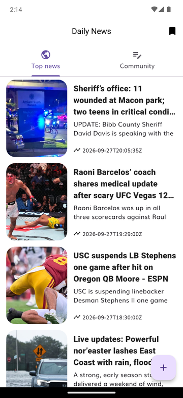 | 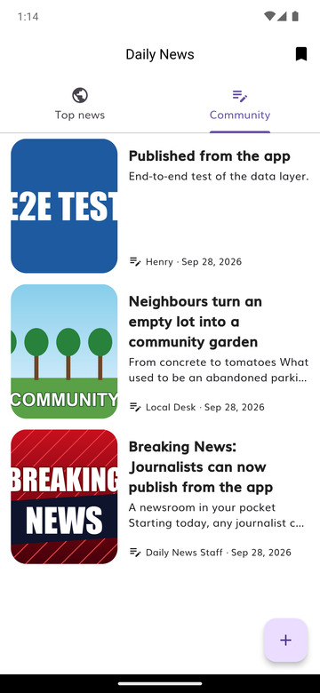 | 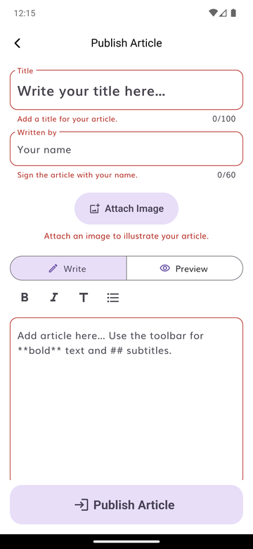 |  |

| Formulario completo | Publicando | Detalle en Markdown | Sin conexión: reintentar |
|---|---|---|---|
| 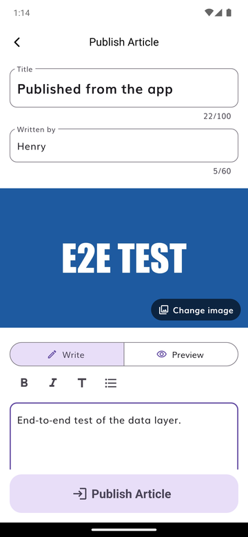 | 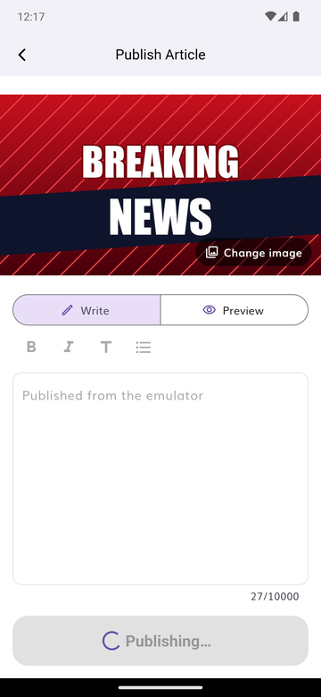 |  | 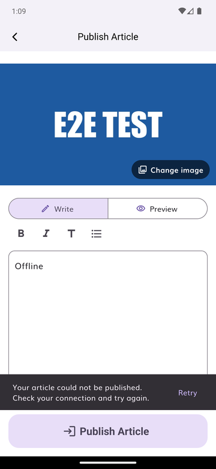 |

| Firma recordada | Guardar borrador al salir (iOS) | Leyendo en voz alta | Siguiendo la frase leída (iOS) |
|---|---|---|---|
| 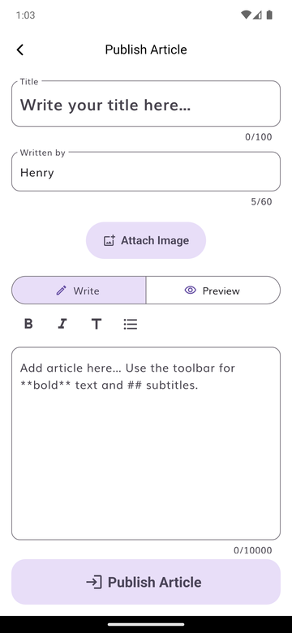 |  |  | 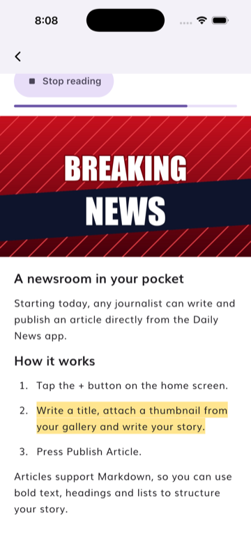 |

| Borrador recuperado tras cerrar la app (iOS) | Modo oscuro (iOS) | En español (iOS) | Letra de accesibilidad grande (iOS) |
|---|---|---|---|
| 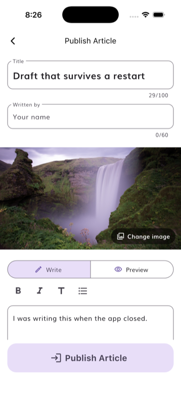 |  | 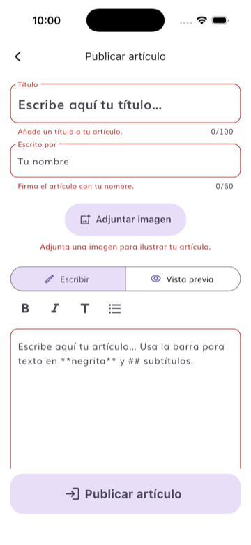 | 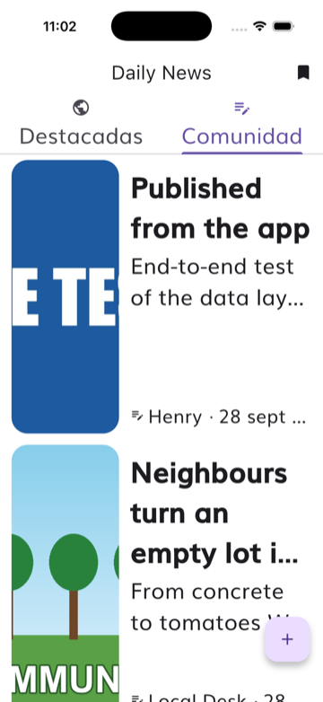 |

### Verificación en producción
Publiqué un artículo real desde la app. El documento `articles/VjV1yr3rUSC8zMzMouvG` tiene
exactamente los 6 campos del esquema y `publishedAt` asignado por el servidor. Su miniatura
`media/articles/VjV1yr3rUSC8zMzMouvG.png` responde `200 image/png`. Además, las peticiones
prohibidas contra producción (editar, borrar, sobrescribir la miniatura, listar sin límite)
devolvieron `403`.

## 6. Extras (*overdelivery*)

### 6.1 Funcionalidades nuevas
**Todos los comentarios del Figma están implementados:**

| # | Comentario | Implementación | Vídeo |
|---|---|---|---|
| 1 | Límite de caracteres en el título | Contador en vivo que cuenta igual que las reglas. El límite se valida en UI, entidad y reglas. | 0:24 |
| 2 | Attach Image abre solo la galería | Selector de imágenes del sistema, nunca la cámara, a través de las capas (use case → repositorio → data source). | 0:29 |
| 3 | Markdown | Editor con barra (negrita, cursiva, subtítulo, lista), vista previa y renderizado en el detalle. | 0:37 |
| 4 | Tocar la imagen para cambiarla | Componente *Add Thumbnail* con dos estados y el chip "Change image". | 0:32 |
| 5 | Mejorar la UI | Pestañas *Top news* / *Community*, pantallas de lista vacía y de error, animación Hero, textos y botones grandes, etiquetas de accesibilidad. | 0:04 |
| 6 | Publicar vacío → errores por campo | Errores en frases claras que se actualizan mientras se corrige. | 0:18 |
| 7 | Confirmación y vuelta a la Home | Salta a *Community*, el artículo aparece el primero y se muestra un aviso. | 1:00 |
| 8 | Estado de carga | Botón deshabilitado con progreso; un doble toque no publica dos veces. | 0:58 |

**Además:**
- **Leer en voz alta**: *(vídeo 1:08)* el botón *Listen to this article* lee el título, la firma y el contenido
  con la voz del propio dispositivo, sin conexión, sin coste y sin claves de API. Convierte el
  Markdown en frases, elige voz en inglés o español según el artículo y se detiene al salir de la
  pantalla. Verificado en el emulador: el sistema muestra la pista de voz mientras lee y ninguna
  después de *Stop* o al salir.
- **Seguir la lectura**: *(vídeo 1:08)* mientras suena, la frase que se está leyendo se resalta en amarillo, la
  pantalla se desplaza sola para mantenerla a la vista y una barra muestra el progreso. Al
  terminar o detener, vuelve el Markdown con su formato. La app habla frase a frase, así sabe
  exactamente cuál suena en Android y en iOS sin depender de los eventos de progreso de cada
  motor de voz, que no se comportan igual. Verificado en el simulador de iPhone.
- **Tiempo de lectura** estimado *(vídeo 1:04 y 0:37)* ("4 min read", a 200 palabras por minuto) junto a la firma, y
  **estadísticas mientras se escribe** bajo el editor ("312 words · 2 min read", en singular si
  toca). El borrador y el artículo publicado cuentan con la misma función del dominio.
- **Accesibilidad comprobada con tests**: *(vídeo 3:18)* 44 tests aplican las guías de accesibilidad de Flutter
  (contraste de texto, tamaño mínimo de los botones en Android e iOS, botones con etiqueta para
  el lector de pantalla) y muestran las pantallas con la letra al 200 %, en modo claro y oscuro,
  en inglés y en español. Encontraron tres fallos reales, ya corregidos (ver la tabla de retos).
- **Modo oscuro**: *(vídeo 2:42)* la app sigue el ajuste del teléfono y cambia al instante. El tema claro no
  cambia; el oscuro usa la misma paleta de Material 3. Los colores fijos (`Colors.black`) del
  código heredado pasaron a salir del tema, y el resaltado de la lectura mantiene el texto oscuro
  para leerse igual de bien en los dos modos.
- **En inglés y español**: *(vídeo 2:59)* todos los textos de la app, incluidos los errores del formulario, los
  avisos y las etiquetas de accesibilidad, salen de archivos ARB con `gen-l10n`, el sistema
  oficial de Flutter. Las fechas y los números se escriben como en cada idioma ("28 sept 2026",
  "10.000 caracteres"). Un test falla si falta una traducción, y el test de integración fija el
  inglés para funcionar en teléfonos de cualquier idioma. Los artículos no se traducen: se
  muestran en el idioma en que se escribieron.
- **Privacidad de las fotos**: *(vídeo 0:29)* antes de subir una imagen se eliminan su ubicación GPS, la cámara
  y las fechas (EXIF, XMP, IPTC), conservando solo la orientación.
- **iOS**: la app funciona en iPhone (probada en el simulador), incluido el test de integración
  del recorrido de publicar.
- **Firma recordada** *(vídeo 1:30)* entre sesiones, sin pisar lo que el periodista ya haya escrito.
- **Borrador guardado automáticamente**: *(vídeo 1:34)* mientras el periodista escribe, el título, la firma, el
  contenido y la miniatura se guardan en el dispositivo un segundo después de dejar de escribir, y
  al salir o antes de publicar. Si cierra la app, se le acaba la batería o la app se cae, al volver
  a pulsar **+** el artículo sigue ahí, con un aviso y la opción *Start over*. Al salir con algo
  escrito, la app pregunta *Keep writing / Discard / Save draft*. Al publicar, el borrador se
  borra. La miniatura se copia a la carpeta privada de la app, porque la del selector de imágenes
  es temporal. Verificado en el simulador de iPhone matando la app y reinstalándola.
- **Paginación infinita** *(vídeo 0:11)* y *pull-to-refresh*; al refrescar, la lista actual sigue en pantalla.
- **Publicación robusta sin conexión**: *(vídeo 1:58)* transacción, límites de tiempo, limpieza de imágenes
  huérfanas y un aviso con **Retry**.
- **Imágenes reducidas en el dispositivo** (1920 px, JPEG 85), muy por debajo del límite de 5 MB.
- **Modo emulador** en la app y **script de seed** que publica pasando por las reglas.

### 6.2 Calidad y *Boy Scout rule* (CG1)
- **Tests**: 355 unitarios y de widgets (entidades, use cases, modelo, data sources con Firebase
  simulado, repositorios, cubits, widgets, pantalla completa y 44 de accesibilidad), 66 de reglas y 1 de integración
  de extremo a extremo (CG 4.2). La mayoría del dominio se escribió primero el test (TDD).
  `test/` refleja `lib/` archivo por archivo, como pide `APP_ARCHITECTURE.md`: en
  `journalist_articles` todos los archivos con lógica tienen su test, y solo quedan sin él las
  interfaces abstractas de los repositorios.
- **CI** en cada push y PR: `flutter analyze` sin ningún aviso, tests, reglas contra el emulador y
  el recorrido de publicar en un emulador Android.
- **Código heredado arreglado**:
  - `DataState` ya no depende de `dio`.
  - `RemoteArticlesState.props` lanzaba una excepción al comparar dos estados del mismo tipo.
  - El botón de recargar de la Home no hacía nada.
  - El marco de imagen de `ArticleWidget` estaba triplicado.
  - Se eliminaron todos los avisos del analyzer.

### 6.3 Prototipos
- **Esquema de la base de datos**: diagrama entidad-relación y diagrama del flujo de publicación
  en [DB_SCHEMA.md](../backend/docs/DB_SCHEMA.md), con su evolución prevista para Auth, categorías
  y App Check.
- **Arquitectura de la funcionalidad** (diagrama de abajo).

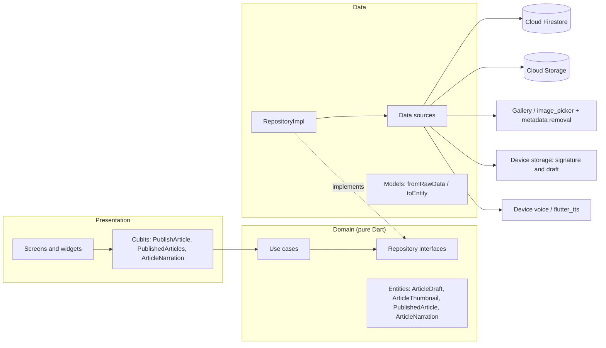

### 6.4 Cómo se puede mejorar este apartado
Las propuestas de la [sección 4](#4-reflexión-y-próximos-pasos), por orden de impacto:
autenticación con editar y borrar, App Check y limpieza programada de huérfanas.

## 7. Secciones extra

### 7.1 Uso de inteligencia artificial
Desarrollé el proyecto trabajando con **Claude Code** (un asistente de programación con IA) como
pareja de programación, y quiero contarlo con transparencia.

- **Mi papel:** definí el plan y el orden de las fases siguiendo el README, tomé y aprobé cada
  decisión (esquema, nombres, alcance, qué extras hacer, qué publicar en producción) y revisé
  cada fase antes de avanzar. También resolví lo que dependía de mi cuenta: el cambio al plan
  Blaze, el permiso IAM de Storage, la revisión de las claves y el cierre de las alertas de
  GitHub.
- **El papel de la IA:** escribió gran parte del código, los tests y la documentación, y verificó
  cada paso: tests, analyzer, emulador Android, Firebase Emulator Suite, producción y CI.
- **Trazabilidad:** todos los commits de la rama llevan la línea `Co-Authored-By: Claude`.

Lo que más me aportó fue la disciplina del proceso: fases pequeñas, verificación real en lugar de
suposiciones, y documentar también los errores y cómo se corrigieron.

### 7.2 Decisiones técnicas principales

| Decisión | Motivo |
|---|---|
| Funcionalidad nueva `journalist_articles` en lugar de ampliar `daily_news` | La entidad de NewsAPI usa un `id` int (Floor) y otros campos. Separarlas evita tocar Floor y cumple el principio de responsabilidad única. |
| La miniatura se sube antes que el documento, y se limpia si el documento falla | Un artículo publicado nunca apunta a una imagen inexistente. |
| Reglas de solo creación mientras no haya Auth | Sin identidad, permitir editar o borrar dejaría a cualquiera modificar artículos ajenos. |
| `thumbnailURL` con la URL de descarga, validada contra el id del documento | La imagen carga directamente en la UI y nadie puede apuntar a imágenes ajenas. |
| `publish` devuelve `DataState<void>` | Separación entre órdenes y consultas (CG 3.6): la Home vuelve a pedir la lista. |
| Carpetas `domain/use_cases` y `presentation/screens` en las dos funcionalidades | Así las nombra `APP_ARCHITECTURE.md`. El código original usaba `usecases` y `pages`; se renombraron también en `daily_news` (*Boy Scout rule*). |
| `PublishArticleCubit` recibe 5 use cases y `PublishArticleUseCase` 3 repositorios | CG 3.5 limita los argumentos de las **funciones** para que sus tests sean simples. Estos son **constructores de inyección de dependencias**: cada argumento es una dependencia que el test sustituye por un mock, y agruparlos en un objeto solo escondería las dependencias. Todas las funciones y métodos tienen 2 argumentos o menos, salvo los dos `errorBuilder` de imágenes, cuya firma de 3 argumentos impone Flutter. |

### 7.3 Métricas
- 57 commits en la rama, uno por paso.
- `journalist_articles`: 55 archivos y unas 3.100 líneas de Dart. Tests de Dart: unas 4.200 líneas. Textos: 56 en inglés y en español.
- Reglas: 114 líneas, cubiertas por unas 400 líneas de tests.
- CI completo: unos 8 minutos, de los que el job de Android es el más lento.
